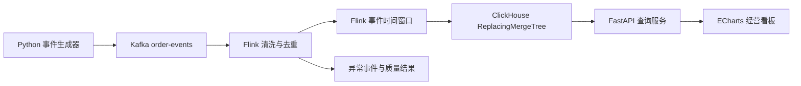

# 电商实时数据仓库与经营分析平台

这是一个面向数据开发和大数据开发实习岗位的作品集项目。项目通过模拟订单事件，逐步实现从事件生成、Kafka 采集、Flink 实时计算、分析存储到经营看板的完整数据链路。

当前版本已经完成事件契约、可复现数据生成、Kafka 本地环境、Flink 计算核心、Kafka Source 作业入口、ClickHouse 分钟指标表和 JDBC Sink，以及只读 FastAPI 指标查询服务。中间件接入始终建立在可验证的数据语义上，避免出现“服务都启动了，但指标口径无法证明正确”的情况。

## 当前进度

- [x] 明确项目范围与验收标准
- [x] 定义订单创建事件 v1
- [x] 实现无第三方依赖的数据生成器
- [x] 为确定性、金额一致性和事件唯一性编写测试
- [x] 提供脱敏示例数据
- [x] 提供 Kafka KRaft Compose 配置和生产、消费、冒烟测试脚本
- [x] 实现可脱离 Kafka 测试的 Flink 事件时间、去重与一分钟窗口聚合核心
- [x] 实现可配置的 Flink KafkaSource、消费位置策略和 checkpoint 作业入口
- [ ] 在真实 Kafka broker 上完成 Flink 端到端运行验收
- [x] 使用 Flink 完成事件时间窗口聚合
- [x] 处理重复事件、乱序事件和迟到事件，并输出质量与迟到侧流
- [x] 配置 Python/API、Java/Flink、Kafka 与 ClickHouse 四层持续集成工作流
- [x] 实现 ClickHouse `ReplacingMergeTree` 指标表、最新版本视图和 Flink JDBC Sink
- [ ] 在真实环境完成 Kafka、Flink、ClickHouse 端到端运行验收
- [x] 提供带参数校验、错误状态和 OpenAPI 文档的 FastAPI 查询接口
- [ ] 提供 ECharts 经营看板
- [ ] 加入数据质量检查、监控与压力测试

## 业务问题

平台最终回答以下问题：

1. 当前每分钟的成交额和订单量是多少？
2. 不同地区、渠道和商品的销售表现如何？
3. 重复事件、乱序事件和迟到事件如何影响指标？
4. 批处理结果和流处理结果是否一致？
5. 当数据质量下降或计算延迟升高时，如何定位问题？

## 计划架构



设计要点：

- 使用事件时间计算业务指标，避免运行速度影响结果。
- 第一版 Watermark 采用固定乱序容忍时间，并为 Kafka 空闲分区设置 idleness，防止整体 Watermark 停滞。
- 每条事件包含全局唯一的 `event_id`，Flink 阶段以此实现幂等去重。
- 金额使用十进制字符串传输，避免浮点误差。
- 压测数字只有在仓库中存在环境说明、脚本和原始结果时才写入简历。
- JDBC Sink 采用批量重试；ClickHouse 用稳定业务键和版本替换吸收重放，查询通过 `FINAL` 视图读取确定的最新结果。

## 目录结构

```text
ecommerce-realtime-warehouse/
├─ .github/workflows/             GitHub Actions 持续集成
├─ data/sample/                  脱敏示例事件
├─ docs/                         需求、架构和数据字典
├─ flink-job/                    Java/Flink 实时计算作业
├─ infra/clickhouse/init/        ClickHouse 初始化 DDL
├─ schemas/                      JSON Schema 事件契约
├─ scripts/                      测试、Kafka 与作业提交脚本
├─ src/event_generator/          事件生成器源码
├─ src/metrics_api/              FastAPI 查询服务与 ClickHouse HTTP 仓库
├─ tests/                        自动化测试
├─ .gitignore
├─ pyproject.toml
└─ README.md
```

## 本地运行

要求 Python 3.11 或更高版本。

生成 20 条示例事件：

```powershell
$env:PYTHONPATH = "src"
python -m event_generator.cli --count 20 --seed 2027 --output data/sample/order_events.ndjson
```

安装查询 API 和测试依赖：

```powershell
python -m pip install -e ".[api,test]"
```

运行全部 Python 测试：

```powershell
$env:PYTHONPATH = "src"
python -m unittest discover -s tests -v
```

事件生成器本身只使用 Python 标准库。相同 `seed`、`count` 和 `start-time` 会生成完全一致的事件，便于重放和测试；FastAPI 查询服务的依赖在 `pyproject.toml` 中单独锁定。

## 文档

- [需求与验收标准](docs/requirements.md)
- [架构设计](docs/architecture.md)
- [事件数据字典](docs/data-dictionary.md)
- [学习单元 01 事件契约与可复现数据](docs/study-01-event-contract.md)
- [学习单元 02 Kafka 本地消息链路](docs/study-02-kafka.md)
- [学习单元 03 Flink 事件时间 去重与分钟窗口](docs/study-03-flink-event-time.md)
- [学习单元 04 JSON 解析 质量侧流与迟到数据](docs/study-04-quality-and-late-data.md)
- [学习单元 05 持续集成与可验证交付](docs/study-05-continuous-integration.md)
- [学习单元 06 Flink KafkaSource 与消费恢复](docs/study-06-flink-kafka-source.md)
- [学习单元 07 ClickHouse 指标存储与重放安全](docs/study-07-clickhouse-sink.md)
- [学习单元 08 FastAPI 参数化查询与接口边界](docs/study-08-fastapi-query-service.md)

## 自动化验证

本地统一运行 Python 和 Java/Flink 测试：

```powershell
./scripts/test-all.ps1
```

GitHub Actions 工作流位于 `.github/workflows/ci.yml`，会并行运行 Python 与 Flink 测试，两者通过后再分别执行 Kafka 生产消费和 ClickHouse 版本替换冒烟测试。工作流尚未在远程仓库运行，因此当前只证明配置已创建并通过本地静态检查，不能宣称远程 CI 已通过。

## Flink 核心测试

要求 JDK 17 或更高版本。以下脚本会优先使用 `JAVA_HOME`，并在 Windows 常见安装目录中自动寻找 JDK 17；环境切换只对测试进程生效，不会修改系统设置。脚本运行 Maven `verify`，同时验证测试和可部署 JAR 构建：

```powershell
./scripts/test-flink.ps1
```

Flink 核心已经实现 JSON 解析、质量侧流、事件校验、Watermark、基于 `event_id` 的状态去重、按地区和渠道统计的一分钟订单量与 GMV，以及迟到数据侧流。KafkaSource 和 ClickHouse JDBC Sink 作业入口已完成；质量与迟到侧流的外部存储仍待完成。

当前验证基线：34 项 Python/API 测试和 24 项 Java/Flink 测试全部通过。

构建包含 Kafka 连接器和 JSON 依赖的可部署 JAR：

```powershell
$env:JAVA_HOME = "你的 JDK 17 路径"
mvn -f flink-job/pom.xml --batch-mode --no-transfer-progress clean package
```

在本地 Flink 集群和 Kafka 已启动后提交作业：

```powershell
./scripts/submit-flink-job.ps1 -StartingOffsets earliest
```

默认配置使用 `localhost:9092`、`order-events` Topic、`ecommerce-order-metrics` Consumer Group、10 秒乱序容忍、60 秒空闲分区检测、10 秒 checkpoint，并将分钟指标批量写入 `jdbc:clickhouse://localhost:8123/ecommerce`。完整参数与设计理由见学习单元 06 和 07。

## Kafka 本地环境

安装 Docker Desktop 后运行：

```powershell
./scripts/kafka-up.ps1
./scripts/kafka-produce-sample.ps1
./scripts/kafka-consume.ps1 -FromBeginning -Count 20
./scripts/kafka-smoke-test.ps1 -Count 20
```

当前开发机没有 Docker CLI，也没有正在运行的 Flink 集群。因此 Kafka Compose、Kafka 冒烟测试和 Flink KafkaSource 只分别完成静态检查、构建与作业图测试，尚未通过真实端到端运行验收。完成验收前，不在简历中宣称 Kafka-Flink 链路已经完成。

## ClickHouse 本地环境

ClickHouse 使用已锁定的官方镜像 `25.8.33.6`，端口只绑定到本机回环地址。启动并检查初始化表：

```powershell
./scripts/clickhouse-up.ps1
./scripts/clickhouse-smoke-test.ps1
```

运行 Flink 作业后查询最新的分钟指标：

```powershell
./scripts/clickhouse-query.ps1 -Limit 20
```

本地 Compose 使用 `CLICKHOUSE_SKIP_USER_SETUP=1`，仅适合单机演示环境，不可直接用于公网或生产部署。若外部 ClickHouse 启用了认证，只通过 `CLICKHOUSE_PASSWORD` 环境变量提供密码；脚本、命令行参数和仓库均不保存密码。

普通 JDBC Sink 具有批量与重试语义，不能据此宣称端到端 exactly-once。`minute_metrics` 使用 `(window_start, region, channel)` 作为稳定键，以单调 `version` 进行替换；`minute_metrics_latest` 视图通过 `FINAL` 返回当前最新版本。当前开发机没有 Docker，因此该容器冒烟测试仍等待远程 CI 或安装 Docker 后实际运行。

## FastAPI 查询服务

先启动 ClickHouse，然后在另一个 PowerShell 窗口启动只监听本机回环地址的 API：

```powershell
./scripts/clickhouse-up.ps1
./scripts/api-up.ps1
```

可用接口：

- `GET /health`：同时检查 API 与 ClickHouse 连通性；数据库不可用时返回 `503` 和稳定错误码。
- `GET /api/v1/metrics/minutes`：查询分钟明细，支持 `start`、`end`、`region`、`channel`、`limit`。
- `GET /api/v1/metrics/summary`：按相同时间和维度条件汇总订单量、GMV、客单价和最新处理时间。
- `GET /docs`：FastAPI 自动生成的交互式 OpenAPI 文档。

未提供时间参数时默认查询最近 24 小时；单次范围最多 31 天，明细最多返回 500 行。地区、渠道、时间和条数都通过 ClickHouse 命名参数绑定，不直接拼接用户输入。金额在 JSON 中以十进制字符串返回，避免浏览器端二进制浮点误差。

API 默认读取 `CLICKHOUSE_HTTP_URL=http://localhost:8123`、`CLICKHOUSE_USER=default`、`CLICKHOUSE_DATABASE=ecommerce`，密码只从 `CLICKHOUSE_PASSWORD` 环境变量读取。当前已完成 13 项接口、仓库与静态约束测试；由于本机没有 Docker，API 到真实 ClickHouse 的联调仍属于待验收项。

## 简历表述原则

在 Kafka、Flink、数据库、测试和压测尚未完成前，不把计划能力写入简历。每完成一个里程碑，再根据仓库中的可验证证据更新项目描述。

