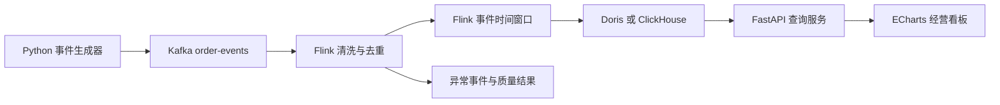

# 电商实时数据仓库与经营分析平台

这是一个面向数据开发和大数据开发实习岗位的作品集项目。项目通过模拟订单事件，逐步实现从事件生成、Kafka 采集、Flink 实时计算、分析存储到经营看板的完整数据链路。

当前版本先完成事件契约和可复现的数据生成器。后续中间件接入必须建立在可验证的数据语义上，避免出现“服务都启动了，但指标口径无法证明正确”的情况。

## 当前进度

- [x] 明确项目范围与验收标准
- [x] 定义订单创建事件 v1
- [x] 实现无第三方依赖的数据生成器
- [x] 为确定性、金额一致性和事件唯一性编写测试
- [x] 提供脱敏示例数据
- [x] 提供 Kafka KRaft Compose 配置和生产、消费、冒烟测试脚本
- [x] 实现可脱离 Kafka 测试的 Flink 事件时间、去重与一分钟窗口聚合核心
- [ ] 接入 Kafka
- [x] 使用 Flink 完成事件时间窗口聚合
- [ ] 处理重复事件、乱序事件和迟到事件
- [ ] 写入分析型数据库
- [ ] 提供 FastAPI 查询接口和经营看板
- [ ] 加入数据质量检查、监控与压力测试

## 业务问题

平台最终回答以下问题：

1. 当前每分钟的成交额和订单量是多少？
2. 不同地区、渠道和商品的销售表现如何？
3. 重复事件、乱序事件和迟到事件如何影响指标？
4. 批处理结果和流处理结果是否一致？
5. 当数据质量下降或计算延迟升高时，如何定位问题？

## 计划架构



设计要点：

- 使用事件时间计算业务指标，避免运行速度影响结果。
- 第一版 Watermark 采用固定乱序容忍时间，并为 Kafka 空闲分区设置 idleness，防止整体 Watermark 停滞。
- 每条事件包含全局唯一的 `event_id`，Flink 阶段以此实现幂等去重。
- 金额使用十进制字符串传输，避免浮点误差。
- 压测数字只有在仓库中存在环境说明、脚本和原始结果时才写入简历。

## 目录结构

```text
ecommerce-realtime-warehouse/
├─ data/sample/                  脱敏示例事件
├─ docs/                         需求、架构和数据字典
├─ schemas/                      JSON Schema 事件契约
├─ src/event_generator/          事件生成器源码
├─ tests/                        自动化测试
├─ .gitignore
├─ pyproject.toml
└─ README.md
```

## 本地运行

要求 Python 3.11 或更高版本。

生成 20 条示例事件：

```powershell
$env:PYTHONPATH = "src"
python -m event_generator.cli --count 20 --seed 2027 --output data/sample/order_events.ndjson
```

运行测试：

```powershell
$env:PYTHONPATH = "src"
python -m unittest discover -s tests -v
```

生成器只使用 Python 标准库，不需要安装依赖。相同 `seed`、`count` 和 `start-time` 会生成完全相同的事件，便于重放和测试。

## 文档

- [需求与验收标准](docs/requirements.md)
- [架构设计](docs/architecture.md)
- [事件数据字典](docs/data-dictionary.md)
- [学习单元 01 事件契约与可复现数据](docs/study-01-event-contract.md)
- [学习单元 02 Kafka 本地消息链路](docs/study-02-kafka.md)
- [学习单元 03 Flink 事件时间 去重与分钟窗口](docs/study-03-flink-event-time.md)

## Flink 核心测试

当前电脑系统默认 Java 为 8，但已安装 JDK 17。以下脚本只在测试进程中临时切换 `JAVA_HOME`，不会修改系统设置：

```powershell
./scripts/test-flink.ps1
```

Flink 核心已经实现事件校验、Watermark、基于 `event_id` 的状态去重，以及按地区和渠道统计的一分钟订单量与 GMV。JSON 解析、Kafka Source、迟到数据侧输出和分析存储仍待完成。

当前验证基线：15 项 Python 测试和 6 项 Java/Flink 测试全部通过。

## Kafka 本地环境

安装 Docker Desktop 后运行：

```powershell
./scripts/kafka-up.ps1
./scripts/kafka-produce-sample.ps1
./scripts/kafka-consume.ps1 -FromBeginning -Count 20
./scripts/kafka-smoke-test.ps1 -Count 20
```

当前开发机没有 Docker CLI，因此 Compose 配置和脚本只完成了静态检查，尚未通过真实运行验收。完成冒烟测试前，不在简历中宣称 Kafka 链路已经完成。

## 简历表述原则

在 Kafka、Flink、数据库、测试和压测尚未完成前，不把计划能力写入简历。每完成一个里程碑，再根据仓库中的可验证证据更新项目描述。

