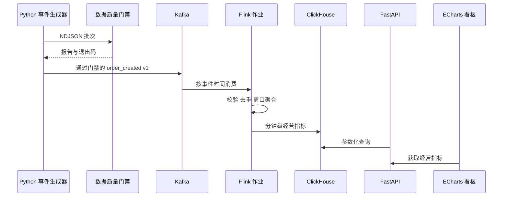

# 架构设计

## 设计原则

项目按“事件契约、消息传输、流式计算、分析存储、查询展示、质量监控”分层。每层先定义输入、输出和验收方法，再选择组件。

## 数据流

## 事件时间策略

- `event_time` 表示订单在业务系统中发生的时间。
- `ingest_time` 表示事件进入数据链路的模拟时间。
- Flink 从 `event_time` 提取时间戳。
- 第一版使用 bounded out-of-orderness Watermark，初始容忍时间设为 10 秒。
- Kafka 分区超过 60 秒无事件时标记 idle，避免某一空闲分区阻塞整体 Watermark。
- 超过 Watermark 的事件进入迟到事件处理路径，是否回补主指标由实验结果决定并记录。

这些参数是第一版实验值，不作为生产最佳实践宣称。后续使用生成器构造不同延迟分布，再比较准确性与延迟。

## 一致性与去重

- 生成器保证正常批次内 `event_id` 唯一。
- 测试批次可以主动注入重复事件。
- Flink 使用 `event_id` 作为去重键，并为状态设置合理 TTL。
- 开启 checkpoint，并使用 exactly-once checkpoint consistency mode。
- 端到端 exactly-once 需要同时满足 source、state、sink 和外部系统条件；项目完成前不在简历中宣称端到端 exactly-once。
- 当前 JDBC Sink 允许批量重试，ClickHouse 使用 `(window_start, region, channel)` 稳定键和单调版本降低重放影响。
- `ReplacingMergeTree` 的物理去重发生在后台合并阶段；即时查询通过包含 `FINAL` 的视图获得最新版本，不能把“最终替换”误写成事务型 upsert。

## 指标定义

| 指标 | 定义 | 维度 |
| --- | --- | --- |
| 订单量 | 去重后的有效订单数 | 分钟、地区、渠道 |
| 成交额 | 去重后的 `total_amount` 之和 | 分钟、地区、渠道 |
| 客单价 | 成交额除以订单量 | 分钟、地区、渠道 |
| 商品销量 | 商品明细 `quantity` 之和 | 分钟、商品 |
| 无效事件数 | 未通过契约或业务规则的事件数 | 分钟、错误类型 |
| 迟到事件数 | Watermark 通过后到达的事件数 | 分钟 |

## 查询服务边界

- FastAPI 只读取 `minute_metrics_latest`，不向分析表写数据，读写职责分离。
- 明细和汇总接口共用开始时间、结束时间、地区、渠道四类筛选条件。
- API 将带时区和不带时区的输入统一为 UTC；无时区输入按 UTC 解释，并限制单次查询不超过 31 天。
- ClickHouse 查询中的值使用 `{name:Type}` 占位符，通过 HTTP `param_name` 传递，用户输入不进入 SQL 结构。
- 金额字段以十进制字符串返回，避免 JavaScript 浮点表示改变金额。
- 空结果返回 `200`、`has_data=false` 或空数组；参数错误返回 `422`；ClickHouse 不可用返回 `503` 和稳定错误码，不向调用者泄露数据库错误详情。
- 当前 API 使用同步标准库 HTTP 客户端。查询规模受范围与条数限制，足以支持个人作品集；若后续压测证明阻塞查询成为瓶颈，再依据数据决定是否引入连接池或异步客户端。

## 看板展示层

- FastAPI 在 `/dashboard` 提供同源静态页面，浏览器访问 API 不需要开放跨域权限。
- 看板不会下载最多 500 条分钟明细后重新计算总体指标；总体、时间序列和维度排行分别由 ClickHouse 聚合接口提供，避免截断数据造成图表口径错误。
- `timeseries` 接口会根据查询范围自动选择 1 分钟、5 分钟、15 分钟或 1 小时时间桶，并限制显式细粒度查询最多约 1500 个点。
- `breakdown` 只允许 `region` 和 `channel` 两个枚举值；列名来自服务端白名单，而不是用户输入。
- ECharts 使用固定版本和子资源完整性校验；页面设置 CSP、`nosniff` 和 `no-referrer` 响应头。
- 图表启用 ARIA 与纹理模式，地区和渠道图提供可展开数据表；页面支持键盘焦点、深色模式、减少动画和移动端布局。
- 独立预览入口使用内存数据，并通过 API 响应头驱动醒目的“演示数据”状态，不把预览结果冒充真实链路证据。

## 数据质量门禁

- `data_quality` 在进入中间件前对 NDJSON 批次执行配置化规则，规则结构固定，不执行配置中的任意表达式或 SQL。
- 质量报告区分总记录、成功解析、非法 JSON、契约无效、重复和超时记录，并以退出码 `0/1/2` 区分通过、规则失败和运行配置错误。
- 分布规则比较实际分类占比与基线占比的最大绝对偏差，并要求最小样本数，避免把小样本波动误判为稳定分布。
- 报告只输出行号、规则原因和必要异常值，不复制整条事件负载；构建产物写入被 Git 忽略的 `build/data-quality`。
- SQLite 历史库使用 `quality_runs` 与 `quality_rule_results` 两张表、外键和事务保存运行摘要；报告内容哈希形成确定性 `run_id`，相同报告重复写入不会产生重复运行。
- 历史查询限制最多 500 条，所有值使用 SQL 参数绑定；趋势按规则 ID 查询并按时间正序返回，便于后续绘图。
- 当前门禁验证静态或重放批次；历史库也不能替代 Flink 侧流持久化、持续调度或生产告警。

## 版本选择

当前已在 Maven 中锁定 Apache Flink 1.20.1、Flink Kafka Connector 3.3.0-1.20、Flink JDBC Connector 3.4.0-1.20、ClickHouse JDBC 0.10.0、Java 11 编译目标和 Jackson 2.19.1，并生成包含 Kafka 与 JDBC 连接器的 shaded 作业 JAR。查询层锁定 FastAPI 0.142.2、Uvicorn 0.54.0 和测试客户端 httpx2 2.13.1；展示层锁定 ECharts 6.1.0。Kafka broker 使用官方 3.9.1 KRaft 镜像，ClickHouse 使用官方 25.8.33.6 镜像；真实集群兼容性仍需通过端到端运行验收后确认。

