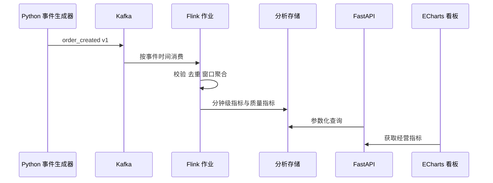

# 架构设计

## 设计原则

项目按“事件契约、消息传输、流式计算、分析存储、查询展示、质量监控”分层。每层先定义输入、输出和验收方法，再选择组件。

## 数据流

## 事件时间策略

- `event_time` 表示订单在业务系统中发生的时间。
- `ingest_time` 表示事件进入数据链路的模拟时间。
- Flink 从 `event_time` 提取时间戳。
- 第一版使用 bounded out-of-orderness Watermark，初始容忍时间设为 10 秒。
- Kafka 分区超过 60 秒无事件时标记 idle，避免某一空闲分区阻塞整体 Watermark。
- 超过 Watermark 的事件进入迟到事件处理路径，是否回补主指标由实验结果决定并记录。

这些参数是第一版实验值，不作为生产最佳实践宣称。后续使用生成器构造不同延迟分布，再比较准确性与延迟。

## 一致性与去重

- 生成器保证正常批次内 `event_id` 唯一。
- 测试批次可以主动注入重复事件。
- Flink 使用 `event_id` 作为去重键，并为状态设置合理 TTL。
- 开启 checkpoint，并使用 exactly-once checkpoint consistency mode。
- 端到端 exactly-once 需要同时满足 source、state、sink 和外部系统条件；项目完成前不在简历中宣称端到端 exactly-once。

## 指标定义

| 指标 | 定义 | 维度 |
| --- | --- | --- |
| 订单量 | 去重后的有效订单数 | 分钟、地区、渠道 |
| 成交额 | 去重后的 `total_amount` 之和 | 分钟、地区、渠道 |
| 客单价 | 成交额除以订单量 | 分钟、地区、渠道 |
| 商品销量 | 商品明细 `quantity` 之和 | 分钟、商品 |
| 无效事件数 | 未通过契约或业务规则的事件数 | 分钟、错误类型 |
| 迟到事件数 | Watermark 通过后到达的事件数 | 分钟 |

## 版本选择

第一版设计参考 Apache Flink 1.20.1 的 DataStream 文档。真正接入前会再次确认 Kafka Connector 与运行环境的兼容矩阵，并在仓库锁定 Java、Flink、Kafka 和数据库版本。

